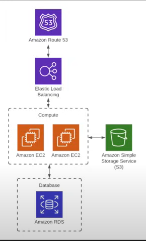

This is a terraform/IaC representation of a simple web application architecture

AWS Services Used:
- Default VPC
- Default Subnets
- Route 53 
    - Primary Zone                                                                       
    - Alias
- Application Load Balancer
    - Ingress and Outgress Rules
    - Target Groups
    - HTTP Traffic
- 2 Amazon EC2 Instances
    - Security Groups 
    - Ingress Rules
    - HTTP Traffic
- S3 Bucket
    - Versioning Enabled
    - Server Side Encryption
- Amazon RDS MySQL Instance

NOTE:

All of this was aimed to be done within the free tier of AWS, there could be improvements made which I will lay out

I had to comment out the route53.tf file because the domain used for the primary zone "example.com" does not work as I do not own a domain myself. However, with an owned domain the infrastructure will work. 

Also, the ".terraform" file is removed due to files being too large to push to github. Make sure you run "terraform init" to allow the infrastructure to work. 

Some Improvements for the Future: 

- Auto Scaling Group to futher enhance availability and scalability
- WAF or CloudFront distribution to increase the security and limit access based off region or ip address
- Creation of VPCs and subnets to further improve security and allow for dedicated environments 

 

