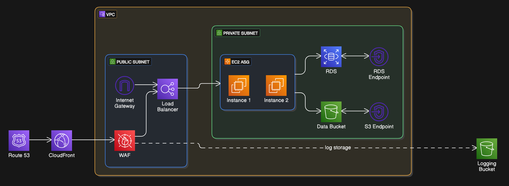

This is a Terraform/IaC representation of a high-level web application architecture.

The architecture consists of a VPC with public and private subnets with internet and NAT gateways. A Route 53 hosted zone routes traffic to a CloudFront distribution, which caches and delivers content from an Application Load Balancer (ALB) deployed in the public subnet. The ALB is protected by an AWS WAF, which enforces IP blocking and geo-restrictions.

Traffic reaching the ALB is forwarded to an Auto Scaling Group (ASG) running two EC2 instances in the private subnet, ensuring scalability and availability. The application interacts with an Amazon RDS MySQL instance, secured within the private subnet via VPC endpoints to restrict public access.

An S3 bucket is used for storage with versioning and server-side encryption enabled within the private subnet via VPC endpoints. Security groups are configured to control inbound and outbound traffic for the ALB, EC2 instances, and RDS. The architecture also includes an Internet Gateway for public subnet access and appropriate route tables to ensure internal and external connectivity. 

AWS Services Used:

- VPC (Virtual Private Cloud)
- Subnets (Public and Private)
- Route 53
- CloudFront
- Application Load Balancer (ALB)
- AWS WAF (Web Application Firewall)
- Auto Scaling Group (ASG)
- EC2 Instances
- Amazon RDS (MySQL)
- S3 (Simple Storage Service)
- VPC Endpoints (S3 and RDS)
- Internet Gateway
- NAT Gateway
- Route Tables
- Security Groups

NOTE: 

All of this was aimed to be done within the free tier of AWS, there could be improvements made which I will lay out

I had to comment out the route53.tf file because the domain used for the primary zone "example.com" does not work as I do not own a domain myself. However, with an owned domain the infrastructure will work. 

Also, the ".terraform" file is removed due to files being too large to push to github. Make sure you run "terraform init" to allow the infrastructure to work. 

Some Improvements for the Future: 

 - Cloudfront "https-only" origin protocol policy with an acm certificate to increase security
 - Logging with Kinesis Data Firehose delivery into an S3 bucket to allow for querying of WAF 
 - As mentioned, with a domain, it could be hosted with route 53 at the front of the application
 - S3 backend to save state file and increase the security of the file 
 - DynamoDB to lock the state of the file in case of collaboration

ARCHITECTURE: 

